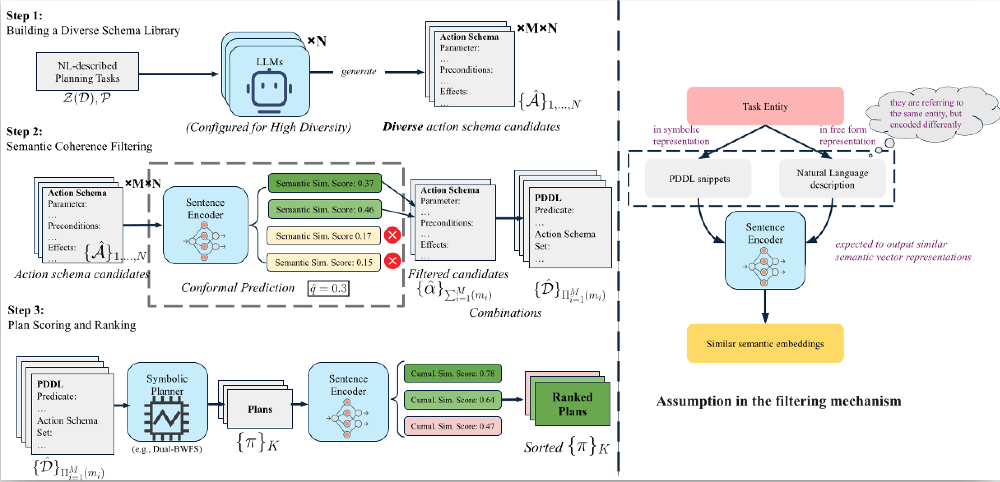

# LLM Symbolic Planning without Experts Project


This repository contains the codebase for the paper **Planning in the Dark: LLM-Symbolic Planning Pipeline without Experts #1843** 

> ***TL;DR:*** We introduce a novel LLM-symbolic planning pipeline that eliminates the dependency on expert intervention by automatically generating, validating, and ranking action schemas. This paves the way for more scalable and accessible planning systems.

>[!IMPORTANT]
> This project utilizes the Kedro framework to enhance code modularity and ensure **reproducibility** to the greatest extent possible. If you encounter any issues related to **reproducibility**, please report them to the authors.


## Directory Structure
```bash
 Official-LLM-Symbolic-Planning-without-Experts
├──  README.md
├──  conf
│   ├──  base
│   └──  local
│       └──  credentials.yml   # Add your LLM api key here
├──  data
│   ├──  01_raw
│   │   ├──  Co-Star-Prompting.md
│   │   └──  pddl_domain # the planning tasks for training, validation and testing, including CoT prompt templates 
│   ├──  02_intermediate
│   │   ├──  action_schema_combination # the output of the action schema combination pipeline
│   │   ├──  pddl_domain # training data for finetuning the sentence encoder
│   │   └──  post_generate_schema_pool # action schema pool after syntax correction
│   ├──  03_primary
│   │   └──  cp_threshold # conformal prediction threshold information
│   ├──  06_models # sentence encoder models checkpoint
│   │   └──  finetuned_sentence_encoder_batch_256_2024-07-06_20-18-22
│   ├──  07_model_output
│   │   ├──  llm_to_domain_to_plans    # generated plans from the LLM
│   │   ├──  pure_generate_schema_pool # conversation details of LLM-symbolic pipeline
│   │   └──  tree_of_thought_plans    # conversation details of ToT approach
│   └──  08_reporting
│       ├──  action_combi_analysis # action schema combination analysis
│       ├──  cosine_sim_comparison_after_finetune  # cosine sim comparison after finetuning
│       ├──  cosine_sim_comparison_of_vanilla_model # cosine sim comparison of vanilla model
│       └──  human_evaluation_results  # human evaluation results
├──  job-scripts       # All the reference job scripts to run the pipeline
│   ├──  job_acquire_plan_and_ranking.sh
│   ├──  job_action_combination_and_analysis_cp_false.sh
│   ├──  job_action_combination_and_analysis_cp_true.sh
│   ├──  job_analyzing_cos_sim_score_for_vanilla_model.sh
│   ├──  job_conformal_prediction_threshold_cal.sh
│   ├──  job_finetune_sentence_encoder.sh
│   ├──  job_finetune_sentence_encoder_smaller.sh
│   ├──  job_generate_schema_pool.sh
│   ├──  job_post_finetune_analysis.sh
│   ├──  job_post_generate_schema_pool_parsing.sh
│   ├──  job_setup_sentence_encoder.sh
│   ├──  job_tot_planning.sh
│   └──  job_tot_planning_test_gpt_on_sussman_anomaly.sh
├──  opt           # external tool (classical planner) to generate plans
│   ├──  README.md
│   └──  planning-as-a-service
│       └──  README.md
├──  pyproject.toml
├──  requirements.txt
└──  src
    └──  better_leveraging_llm_to_construct_world_models
       └──  pipelines         # All modules of the LLM-symbolic planning pipline
          ├──  action_schema_combination # get all schema set combinations and obtaining viable action schema sets by using classical planner
          ├──  bisim_evaluation # deprecated because it require the parameters of actions to be the same as the reference model
          ├──  compare_cos_sim_between_act_and_nl_desc # calculate the cos. sim. between the action schema and the natural language description
          ├──  conformal_prediction_filtering    # calculate the conformal prediction threshold based on the validation dataset.
          ├──  finetuning_sentence_encoder   # finetune the sentence encoder
          ├──  generate_schema_pool                 # generate action schema pool
          ├──  plan_evaluation   # human blind evaluation on the plan quality
          ├──  post_construction_ranking # obtaining ranking score for the plan candidates
          ├──  post_generate_schema_pool # Validate the syntax of the generated domain models
          ├──  setup_sentence_encoder    # init the sentence encoder
          └──  tree_of_thought_direct_planning # ToT approach to generate plans

```

>[!TIP]
> There are readme files in the subdirectories of the project. Please refer to them for more detailed information.


## Installation Steps
1. Setup the environment
```bash
conda create --name=btrpddl python=3.10
conda activate btrpddl
# change the directory to the project root
pip install -e .
# go to opt/planning-as-a-service and follow the README.md to setup the classical planner
```

2. Provide API key for the LLMs models
   - please add your API key in `conf/local/credentials.yml`
## How to Use
To run the pipeline, follow the following steps:

1. Checking and updating the parameters in the `conf` directory
2. `kedro run -p` the pipeline. A suggested order is provided in `.vscode/launch.json` for reference. We suggest to check job scripts in `job-scripts` for the reference of running the pipeline.


```json
"configurations": [
        {
            "name": "Python: Kedro Run Cross Encoder Setup",
            "type": "debugpy",
            "request": "launch",
            "console": "integratedTerminal",
            "module": "kedro",
            "args": ["run", "-p", "setup_sentence_encoder"]
            // Any other arguments should be passed as a comma-seperated-list
            // e.g "args": ["run", "--pipeline", "pipeline_name"]
        },
        {
            "name": "Python: Kedro Run Analyze Cosine Sim",
            "type": "debugpy",
            "request": "launch",
            "console": "integratedTerminal",
            "module": "kedro",
            "args": ["run", "--from-nodes=init_cross_encoder_model_node", "--to-nodes=generate_boxplot_from_cos_sim_data_node",
            "--params", "setup_sentence_encoder_cfg.model_type=bi_encoder"]
        },
        {
            "name": "Python: Kedro Run FineTune Sentence Encoder",
            "type": "debugpy",
            "request": "launch",
            "console": "integratedTerminal",
            "module": "kedro",
            "args": ["run", "-p", "finetuning_sentence_encoder"]
        },

        {
            "name": "Python: Kedro Run FineTune Google T5",
            "type": "debugpy",
            "request": "launch",
            "console": "integratedTerminal",
            "module": "kedro",
            "args": ["run", "-p", "finetuning_sentence_encoder", "--params", "finetuning_encoder_cfg.train_batch_size=16,setup_sentence_encoder_cfg.model_name=google/flan-t5-xl,setup_sentence_encoder_cfg.model_type=bi_encoder,finetuning_encoder_cfg.is_finetune_complete=false,finetuning_encoder_cfg.train_batch_size=1024"]
        },
        {
            "name": "Python: Kedro Run LLM Query Ensemble",
            "type": "debugpy",
            "request": "launch",
            "console": "integratedTerminal",
            "module": "kedro",
            "args": ["run", "-p", "generate_schema_pool"]
        },
        {
            "name": "Python: Kedro Run ToT Planning",
            "type": "debugpy",
            "request": "launch",
            "console": "integratedTerminal",
            "module": "kedro",
            "args": ["run", "-p", "tree_of_thought_direct_planning", "--params", "tot_direct_planning_cfg.tree_breadth=4"]
        },
        {
            "name": "Python: Kedro Run Post Majority Vote Parsing",
            "type": "debugpy",
            "request": "launch",
            "console": "integratedTerminal",
            "module": "kedro",
            "args": ["run", "-p", "post_generate_schema_pool"]
        },
        {
            "name": "Python: Kedro Run CP calculation",
            "type": "debugpy",
            "request": "launch",
            "console": "integratedTerminal",
            "module": "kedro",
            "args": ["run", "-p", "conformal_prediction_filtering"]
        },
        {
            "name": "Python: Kedro action combination",
            "type": "debugpy",
            "request": "launch",
            "console": "integratedTerminal",
            "module": "kedro",
            "args": ["run", "-p", "action_schema_combination", "--params", "use_cp=false"]
        },
        {
            "name": "Python: Kedro Post Construction Ranking",
            "type": "debugpy",
            "request": "launch",
            "console": "integratedTerminal",
            "module": "kedro",
            "args": ["run", "-p", "post_construction_ranking"]
        },
        {
            "name": "Python: Kedro Human Evaluation",
            "type": "debugpy",
            "request": "launch",
            "console": "integratedTerminal",
            "module": "kedro",
            "args": ["run", "-p", "plan_evaluation"]
        },
    ]
```

>[!NOTE]
> The experiments require you to provide the API token for the LLMs models. If you encounter any issues, please submit an issue in the repository. Common issues are: 1) some models uses the absolute path, requiring the user to modify them manually, 2) the API token is not provided in the `conf/local/credentials.yml` file. 3) tools in the opt folder are not installed properly.