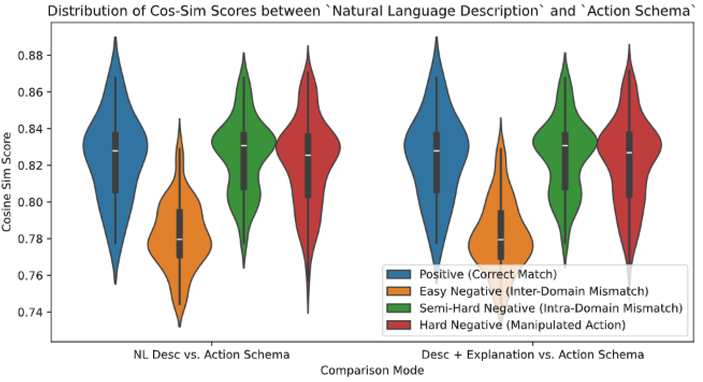

## Observations from previous analysis

The plot in `data/08_reporting/boxplot_cosine_sim_comparison.pdf` shows that the semantic sentence encoder can differentiate between positive and negative examples to some extent. This suggests that we can use the semantic sentence encoder to determine if the generated action schema matches the natural language description, acting as a semantic validation tool. However, the difference in cosine similarity between the positive and negative examples is not very significant. To improve this, we can try fine-tuning the sentence encoder using the triplet loss function.

**FYI, what is easy negatives, semi-hard negatives and hard negatives**

In our case where we want to match the descriptions with the action schema, the easy negatives can be the action schema from other domains, the semi-hard negatives can be the action schema from the same domain but different action, and the hard negatives can be the action schema from the same domain but manipulated a bit (polluted with noise).

## Fine-tuning with easy negatives, semi-hard negatives, and hard negatives triplet loss
In our case where we want to match the descriptions with the action schema, the easy negatives can be the action schema from other domains, the semi-hard negatives can be the action schema from the same domain but different action, and the hard negatives can be the action schema from the same domain but manipulated a bit (polluted with noise).

## How to train in Sentence Transformer library 
- ref: https://github.com/UKPLab/sentence-transformers/blob/master/examples/training/nli/training_nli_v3.py

## Why no LoRA ? 
According to https://github.com/UKPLab/sentence-transformers/issues/2748#issuecomment-2175246693, LoRA training can be unstable. Given that our training dataset is small, we should avoid using LoRA. 